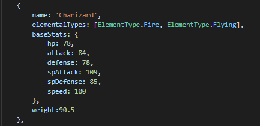
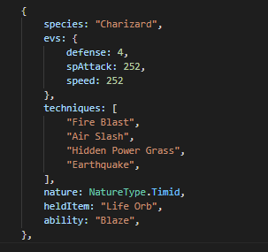
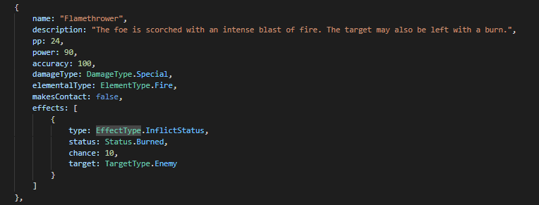
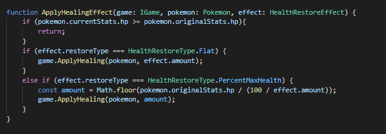
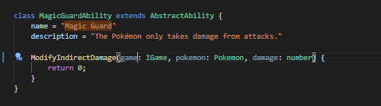
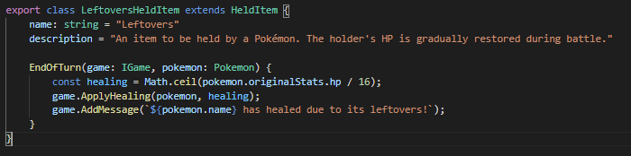
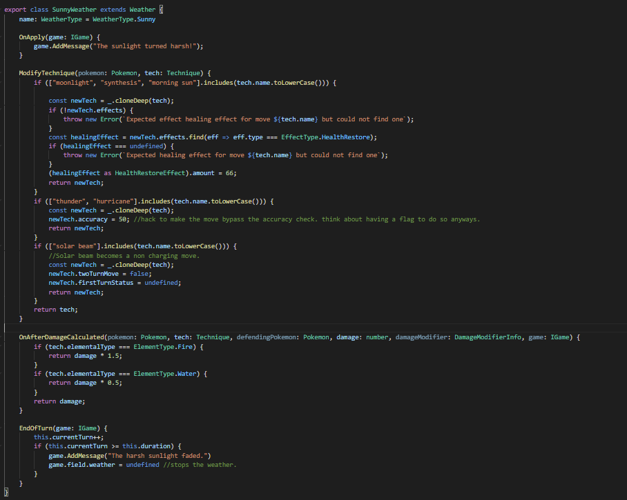
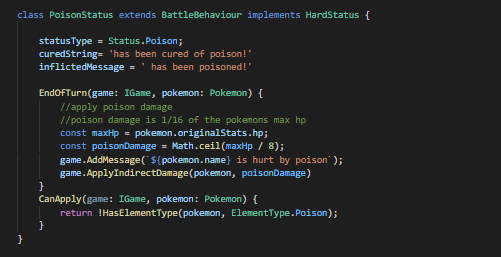
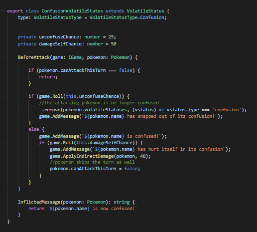

**Goal of the Project**

The goals of this project were as follows.

-   Learn Typescript

-   Learn React Hooks

-   Try out Organic Programming

-   Figure out an architecture that would work for creating a Pokemon
    battle game

-   Create an online server for players to play over the internet

This is not my first attempt at creating a Pokemon Battle game. When I
was 16 I attempted to create one using a software called Game Maker, but
eventually stopped working on it as it became too complex for me to
handle at the time. So I was hoping that in the 14 years that had passed
between now and then that I had gained enough skills to be able to
complete this project.

This article will be easier to read if you already have some knowledge
of how Pokemon works. Since it's a very complex game, I will not be
going over that in this document.

**Project Management**

For the project management side of this project I used the app Trello to
keep track of tasks that needed to be completed.

I decided to do everything month by month. At the start of the month I
would have a list a features written down of what I thought I could
accomplish in a month and a checklist of tasks associated with those
features.

I think it's important not to rely on pure willpower or motivation when
completing longer projects. Understanding how your brain works and being
able to trick it in order to maintain consistent work periods is
important.

In order to combat this I would make sure to have "gimme" tasks written
down at all times. These are small 5-10 minute tasks which were not
necessarily super important, but would allow me something easy to get
started with and checked off in a work session.

Those gimme tasks actually ended up being very important to maintaining
my discipline in completing this project. A lot of times I would log
onto my computer with the intention of just completing one of those
small tasks so I didn't feel bad about not making progress. Doing that
one small task would easily end up turning into 2-3 hours of working as
the momentum of completing one thing led me wanting to do more.

**Organic Programming**

For this project I wanted to try out Organic Programming. To be honest,
I do not remember where I heard this term as I no longer can locate the
article in which I read it from. Either way it is more of a different
metaphor of viewing software development rather than a brand new
technique.

Sometimes people view software similar to construction, where its
architecture needs to be ***planned*** in detail. After that we
***build*** the software and once its built we ***maintain*** the
software by fixing cracks and painting its metaphorical walls once in a
while. Even if project management techniques like "Agile" have tried to
make this a more iterative process, it still feel like for the most part
we view software as a bunch of mini construction projects that are
planned, built and maintained.

With Organic Programming the idea is to view software like a living
thing that is constantly evolving and adapting to its environment. In
this case the environment is the features that your users need and
evolving means aggressively refactoring your codebase to make things
easier for everyone involved. You do not make big architectural
decisions up front. Bur rather you defer architectural decisions until
you are 100% sure it will add value to your codebase. This is because
the more complex architecture you implement in a project the harder it
becomes to change.

The basic development loop for organic programming is as follows

1.  Program the simplest thing possible that gets the task or feature
    done.

2.  As you are programming, look for inefficiencies. Examples could be,
    A variable name is misleading, Did I introduce a bug accidently, Am
    I needing to keep too many things in my head to work on this part of
    the codebase

3.  Refactor to try to solve or minimize some of the issues as the last
    part of creating the feature.

This way, instead of treating refactoring as a separate task that is
more likely to get kicked down the road, you treat it as part of
implementing the feature. This has the effect of having a higher chance
of your codebase evolving based on the features you work on.

While using this mindset, I actually found it to work really well. For
the most part, the code base was kept in relatively good shape for the
content I needed to add in. Throughout the whole project I only had to
do 3 big refactors that would take just a couple hours each. Most of my
refactors were small 5-10 minute tasks that could easily be completed
and checked off.

Overall, I think Organic programming is a great way to be able to
develop software If you don't exactly know how you are going to
architect your code base right at the start. I think it would only work
best for smaller teams though. It takes great discipline to continuously
refactor so it may not be a good choice for larger teams where it would
be more difficult to enforce and manage. I think a healthy mixture of
planned and organic development will likely be the best way going
forward. You could definitely shortcut some things by starting with
architectures you know will have value, but keeping other parts of your
codebase open for evolving.

**Tech Stack**

This project was programmed in Typescript using React Hooks for the
Front End and Node.js, Express and socket.io for server. The server is
currently hosted on Heroku using a free dyno instance.

This was my first project using Typescript, and I was very satisfied
with the language. I don't think I will ever go back to programming in
vanilla Javascript as long as I can help it.

Sharing the code between the Front End and the Back End with TypeScript
was very valuable. I started programming the game logic in the front end
first. When it was time to program the server, it was relatively easy to
get it up and running, I just added a reference to the game logic code
path and was able to build a really basic server around it. If I was
building this from the beginning I would have structured my folders like
\[FrontEnd\]\[Game Logic\] \[BackEnd\]. In this case, my game logic code
is stored in the front end folder, but I did not see a reason to change
that since at that point the project was coming to a conclusion.

This was also my first time using React Hooks. I felt it great to use
for the more typical web dev type UI stuff. When it came to the actual
Pokemon Battle UI it felt like I was battling against React Hooks and
the functional style in order to get what I wanted done. This could just
be my inexperience of programming in a more functional style and I just
don't know how to solve certain problems nicely yet. But It was also
hard to search for information on how to get certain things done, I
believe this is because most people are not using React Hooks to program
games and the problems that I had were not typical problems. That being
said, React Hooks seems great for typical Web Development and could be a
fine prototyping tool for more UI heavy games. I could definitely see
myself using it to get something quick up and running.

**Game Logic Architecture**

The final architecture consists mainly of the parts below.

**GAME**

***Handles all the logic for controlling each turn, for example
processing the actions that each player performed, deciding when or when
not to run certain functions etc.***

**DATA**

***These are parts of the game that we were able to express in pure
data. In this case "data" are just Plain Old Typescript Objects with no
functions attached to them. In another system these could very easily be
grabbed from a database or saved from a file.***

-   Species

{width="4.510416666666667in"
height="2.1875in"}

-   Pokemon

{width="3.15625in"
height="2.96875in"}

-   Techniques

{width="6.5in"
height="2.4756944444444446in"}

**EFFECTS**

***These are functions which can directly change the state of a game.
For example a technique like Synthesis will heal a Pokemon. This happens
by calling the ApplyHealingEffect function.***

{width="6.5in"
height="2.2597222222222224in"}

**BATTLE BEHAVIOURS**

***These are classes or objects which contain callback functions which
will be called at certain parts of the turn structure. For example the
Magic Guard Ability below modifies any indirect damage(like poison or
confusion damage) received to 0.***

Abilities,

{width="4.979166666666667in"
height="1.3958333333333333in"}

HeldItem,

{width="6.5in"
height="1.6159722222222221in"}

Weather

{width="6.5in"
height="5.190277777777778in"}

Hard Statuses

{width="5.21875in"
height="2.6770833333333335in"}

Volatile Statuses

{width="5.375in"
height="4.84375in"}

Due to our use of Organic Programming, this architecture was not
actually designed from the start, but was refactored into over time
based on ease of implementing certain features. It is not perfect and
has some flaws and inconsistencies with the implementation, but I feel
like this architecture could be a good start for many other turn-based
games I want to make in the future. There are some things I would do
differently from the start. For example, if I could somehow be able to
express a BattleBehaviour in pure data that could increase the
flexibility of my architecture by allowing me to easily modify or create
them at runtime or save them to a database or file. When I work on
another turn based game project, I will look into figuring out how to do
this.

**Artificial Intelligence**

Artificial Intelligence is sort of a buzzword these days, so when I say
Artificial Intelligence, I actually just mean general programming
instructions. There were no neural networks or machine learning
techniques used.

I wanted to add a bunch of Pokemon, Techniques and Abilities to the game
so I researched a way that could write an A.I. without needing to
constantly update it. This led me to two A.I. algorithms

-   Monte Carlo Simulation

-   MiniMax

They are both similar and act based on a (State,Action) =>
ResultingState function. So in order to do this, we had to be able to
simulate our game in the background. Thankfully since I had already had
my game decoupled from everything else this was really easy to implement
and play around with.

The Monte Carlo Simulation method simulates the game for each possible
action until a termination point is reached. It then will give you the
action which led to the most winning points which will be the one your
AI picks to use.

The MiniMax method is slightly different. It too simulates the game but
it relies on an Evaluate method to score the resulting state based on
whether it is good or bad for the AI. This means it does not need to
simulate the entire game to figure out a move, but it depends on the
programmer knowing enough about the game in order to make a good enough
Evaluate method.

Both of these methods could be visualized by a tree of nodes containing
the action, resulting state and the score.

I don't want to get more into detail, but more information about these
methods can be easily found with a google search.

There were some issues with implementing these in our game though.

-   Both players select a move at the same time and the move you select
    might depend on the move you think your opponent will select. This
    means we cannot simply rely on a state and our action, we would also
    have to consider our opponents action as well.

-   There is a huge random element to the game, which means that we
    cannot assume that performing the same action on the same state will
    produce the same result. This means we cannot easily cache results
    for a performance boost.

-   Performance of the game loop matters a lot with this type of A.I.
    And as such we needed to spend time optimizing the game loop.

Overall I ended up using a poorly implemented MiniMax method, but It
actually worked very well. I was able to get something up and running in
less than 2 days. Originally I wanted to simulate many levels deep but
ran into both performance and inexperience issues. Because I didn't want
to spend too much time figuring it out, I decided to only run 1
simulation per action and no more than 2 levels deep.

After I got the AI running, I had an idea. What if I build a simulation
mode where I was able mass battle 2 AI's together and be able to see the
results?

This is what drove the AI vs AI Simulation mode.

Specifically in the Team Battles simulation mode, I simulate a bunch of
battles with random teams for each AI. The pokemon on the winning team
each get a win on the charts and the pokemon on the losing team each get
a loss.

I had a lot of fun with this, but to my surprise it came with a few
positive things I didn't think of at first.

-   Simulating a bunch of games is a great way to test your code for
    runtime errors..

-   You could check to see which characters (in our case Pokemon) are
    over-performing / under-performing and potentially balance the game
    based on this information.

-   Its also a good way to benchmark the performance of your game, and
    find which areas are the biggest problem.

These points are such huge advantages that I will be adding this feature
to any turn based game I make in the future, even if it is just for
debug purposes.

My favourite bug that I found this way was a never-ending game between 2
Clefables that couldn't kill each other. This only would happen about
once in 2000 game simulations. Sometimes the simulation would just stop,
but not throw any runtime error which confused me. At first I thought
maybe it was some sort of browser problem that might be stopping my
script from running for too long, but it kept happening randomly,
sometimes early on and sometimes later on. Once I checked what was going
on in the game logs when the simulations stalled, it showed me that 2
Clefables had been battling each other for thousands of turns. This
should have never happened as the official Pokemon game has a built in
feature to stop infinite games (the struggle move) but mine was bugged
due to Clefable's ability preventing the recoil damage that should have
been dealt. This was something that would have been next to impossible
to catch without a mass amount of people testing the game.

**Overall Lessons Learned**

-   Typescript was very fun to use, will use it over Javascript whenever
    possible

-   Organic Programming is a great mindset to have when you don't know
    how to setup your architecture before hand

-   MonteCarlo / MiniMax A.I. algorithms are very general algorithms
    that could be useful in a variety of projects.

-   Try to keep objects as pure data when possible, as it can make a
    system very flexible.
